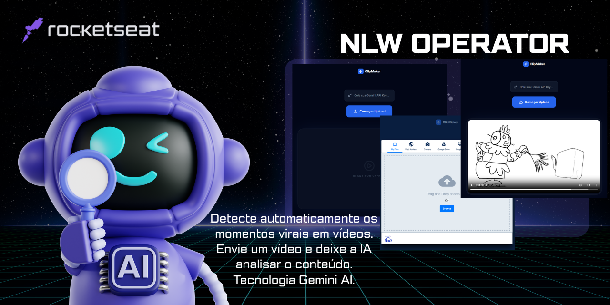

# 🎬 ClipMaker AI

  

Ferramenta web que utiliza **inteligência artificial** para encontrar automaticamente os momentos mais interessantes de um vídeo.

O usuário envia um vídeo, o sistema gera a transcrição automaticamente e a IA analisa o conteúdo para identificar **trechos virais entre 30 e 60 segundos**.

---

## ⚙️ Como funciona

1. Insira sua **Gemini API Key**
2. Faça **upload do vídeo**
3. O sistema gera a **transcrição automaticamente**
4. A **IA analisa o conteúdo**
5. O projeto retorna o **momento mais viral**

---

## 🚀 Tecnologias utilizadas

- HTML  
- TailwindCSS  
- JavaScript  
- Cloudinary  
- Gemini AI  

---

## 💡 Sobre o projeto

Este projeto foi desenvolvido durante o **NLW Operator da Rocketseat**, explorando integração entre upload de vídeo, processamento de mídia e inteligência artificial para geração automática de highlights.

---

## 👩‍💻 Autora

Débora Souza